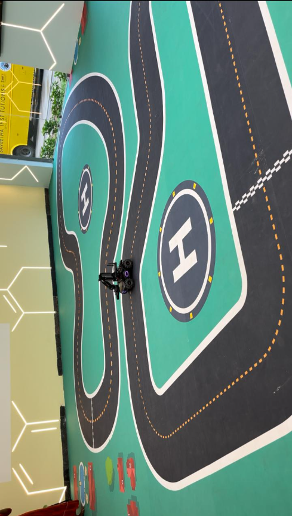

# MobileRobot-Openloopcontrol
## Aim:
To develop a python control code to move the mobilerobot along the predefined path.

## Equipments Required:
1. RoboMaster EP core
2. Python 3.7

## Procedure
### Step1:
Initiate the MobileRobot.
### Step2:
 Connect your PC with the MobileRobot through Wi-Fi.
### Step3:
Open batter_level.py file and check the battery.
### Step4:
Open the other Python files and Program the movements of the robot using python.
### Step5:
 Execute the python program and record the movements.
## Program
```python
#DEVELOPED BY : Nithilan S
#REGISTER NUMBER : 212223240108
from robomaster import robot
import time
from robomaster import camera
if _name_ == '_main_':
    ep_robot = robot.Robot()
    ep_robot.initialize(conn_type="ap")

    ep_chassis = ep_robot.chassis
    ep_led = ep_robot.led
    ep_camera = ep_robot.camera
    print("Video streaming started.....")
    ep_camera.start_video_stream(display=True, resolution = camera.STREAM_360P)

    ep_chassis.move(x=2.6, y=0, z=0, xy_speed=1).wait_for_completed()
    ep_led.set_led(comp = "all",r=0,g=255,b=255,effect="on")
    ep_chassis.move(x=0.2, y=0, z=60, xy_speed=1).wait_for_completed()
    ep_led.set_led(comp = "all",r=204,g=255,b=255,effect="on")
    ep_chassis.move(x=0.85, y=0, z=0, xy_speed=1).wait_for_completed()
    ep_led.set_led(comp = "all",r=255,g=255,b=0,effect="on")
    ep_chassis.move(x=0, y=0, z=80, xy_speed=1).wait_for_completed()
    ep_led.set_led(comp = "all",r=255,g=128,b=128,effect="on")
    ep_chassis.move(x=0, y=0, z=0, xy_speed=1).wait_for_completed()
    ep_led.set_led(comp = "all",r=255,g=102,b=0,effect="on")
    ep_chassis.move(x=0.78, y=0, z=00, xy_speed=1).wait_for_completed()
    ep_led.set_led(comp = "all",r=204,g=153,b=255,effect="on")
    ep_chassis.move(x=0, y=0, z=40, xy_speed=1).wait_for_completed()
    ep_led.set_led(comp = "all",r=153,g=204,b=0,effect="on")
    ep_chassis.move(x=1, y=0, z=0, xy_speed=1).wait_for_completed()
    ep_led.set_led(comp = "all",r=153,g=51,b=102,effect="on")
    ep_chassis.move(x=0, y=0, z=-45, xy_speed=1).wait_for_completed()
    ep_led.set_led(comp = "all",r=0,g=255,b=0,effect="on")
    ep_chassis.move(x=1.55, y=0, z=0, xy_speed=1).wait_for_completed()
    ep_led.set_led(comp = "all",r=255,g=0,b=255,effect="on")
    ep_chassis.move(x=0, y=0, z=50, xy_speed=1).wait_for_completed()
    ep_led.set_led(comp = "all",r=153,g=153,b=255,effect="on")
    ep_chassis.move(x=1.5, y=0, z=0, xy_speed=1).wait_for_completed()
    ep_led.set_led(comp = "all",r=0,g=0,b=128,effect="on")
    ep_chassis.move(x=0, y=-2.1, z=0, xy_speed=1).wait_for_completed()
    ep_led.set_led(comp = "all",r=102,g=102,b=153,effect="on")
    ep_chassis.move(x=-0.6, y=0, z=0, xy_speed=1).wait_for_completed()
    ep_led.set_led(comp = "all",r=128,g=0,b=128,effect="on")
    ep_chassis.move(x=0, y=0, z=175, xy_speed=1).wait_for_completed()
    ep_led.set_led(comp = "all",r=51,g=51,b=0,effect="on")
    ep_chassis.move(x=0, y=0, z=0, xy_speed=1).wait_for_completed()
    ep_led.set_led(comp = "all",r=153,g=153,b=255,effect="on")
    time.sleep(4)
    ep_camera.stop_video_stream()
    print("Stopped video streaming.....")
    ep_robot.close()
```

## MobileRobot Movement Image:


## Image:

## MobileRobot Movement Video:
(https://youtu.be/v5N_p11ex0U?si=6KyKOoVynWKWNPX6)

## Result:
Thus the python program code is developed to move the mobilerobot in the predefined path.

```
Mobile Robotics Laboratory
Department of Artificial Intelligence and Data Science/ Machine Learning
Saveetha Engineering College
```
